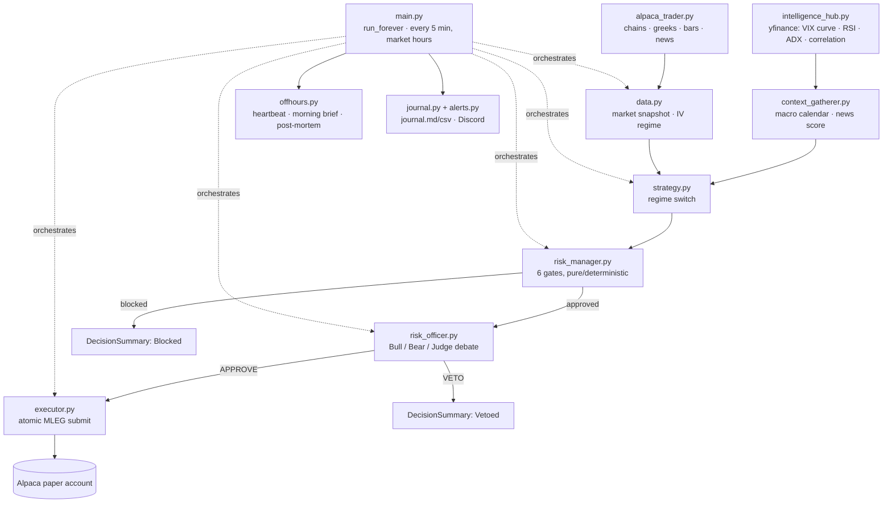

# The Volatility Arbiter

An autonomous options-trading agent that trades a basket of liquid ETFs on an Alpaca paper account, inside risk limits it has no code path to override. Built for the **Alpaca × LabLab.ai hackathon**.

## Quick facts

| | |
|---|---|
| Tests | **498 passing / 11 failing** (509 total, offline) — the 11 are a wall-clock time bomb, not a logic bug; see below |
| Language / stack | Python 3.12, `alpaca-py`, `pandas`/`numpy`, `yfinance`, Streamlit (audit dashboard), React/Vite (landing page) |
| Hackathon | Alpaca × LabLab.ai |
| Account | `PA3FCNG4S7EO` — paper trading only |
| Result | $100,000.00 → $96,868.97 · **−3.13%** · account flat, 0 open positions |

## 30-second summary

It picks a defined-risk options structure — iron condor, credit vertical, or long strangle — based on the live volatility regime, sizes it against a hard 1.5%-of-equity risk cap, has an LLM Bull/Bear/Judge panel argue the trade before it can go out, and manages the position to an exit. Every numeric limit lives in `risk_manager.py` as a plain constant, is enforced in code before an order can be built, and is re-checked against *live* equity at submission — not the equity the idea was proposed against.

Over the final competition session it evaluated 165 trade proposals, executed 40, and finished **down $3,131.03 (−3.13%)** against its $100,000.00 starting balance. The loss happened entirely inside limits that never moved — the account's low point stayed $1,869 clear of the $95,000 hard floor that would have force-flattened everything and halted the run for good.

## Live links

| | |
|---|---|
| **Landing page** | https://web-gamma-liard-90.vercel.app |
| **Audit dashboard** (read-only, live evidence) | https://alpaca-options-agent-ulckr2ugynvqnerbdwohb2.streamlit.app/ |
| **GitHub repo** | https://github.com/kedar4real/alpaca-options-agent |
| **Write-up** | this README |

No video link yet — the Video Walkthrough card is intentionally left out of the landing page rather than pointing at a link that doesn't resolve. Will be added back once one's live.

---

## How it works

### Data & signals

**Alpaca** (`alpaca_trader.py`, `data.py`) is the trade-of-record source: option chains with greeks and IV, spot prices, daily/intraday bars, news, and all order routing. The chain pull is narrowed to 1–3 DTE and strikes within ±5% of spot before anything else runs.

**yfinance** (`intelligence_hub.py`) is the quantamental layer on top: VIX / VIX3M term structure (backwardation → a panic-regime flag), per-ticker 14-day RSI and Wilder ADX, and 10-day return-correlation clusters. It falls back to Alpaca pipe-by-pipe on failure, and a total outage degrades to `"No Context Available"` rather than raising — the officer is told to treat that as a reason for caution, not confidence.

A bundled 2026 macro calendar (FOMC, CPI, NFP) flags high-impact events inside a 48-hour window without a network call.

### The regime-switching strategy engine

`strategy.select_regime()` reads the volatility surface each cycle and picks a structure:

| Regime | Condition | Structure |
|---|---|---|
| A | IV richer than RV by ≥1.5 vol points, IV elevated | Iron condor |
| B | IV ≪ RV, range-bound (Kaufman ER < 0.45) | Long strangle |
| C | IV ≪ RV, trending | Bull put / bear call, aligned with the trend |
| HARVEST | opt-in directional override: news sentiment clears ±0.2 | Bull put / bear call at a wider 0.35Δ short leg, allows 0-DTE |
| — | anything else | No trade |

Two more overrides sit on top of the regime table itself: an **ADX filter** disables the iron condor once a trend is confirmed (ADX ≥ 25) and demands a directional spread instead, and a **macro override** vetoes every short-volatility selection inside 48 hours of a high-impact event or a VIX-curve inversion, forcing a long strangle instead. Full decision table and every threshold: [`docs/REGIME_DECISIONS.md`](docs/REGIME_DECISIONS.md).

### The risk-gate architecture

Every gate is a plain constant in `risk_manager.py`, checked in `check_order()`, which collects *every* failing gate rather than stopping at the first:

| # | Gate | Limit |
|---|---|---|
| 1 | Max risk per trade | **1.5%** of current equity (halved on a high-impact macro day) |
| 2 | Daily loss halt | 3.5% of starting equity → no new trades today |
| 3 | Total drawdown floor | 5% of starting equity → sticky halt for the run |
| 4 | Max concurrent positions | 4 |
| 4b | Correlation guard | a >0.8 (10-day) correlated cluster shares one slot, not one each |
| 4c | Long-vol concentration | ≤3 debit positions, ≤4% of equity in total premium |
| 5 | Defined-risk invariant | matched long/short contracts per right, or all-long |
| 6 | Expiry auto-close | force-close within one trading day of expiry |

```python
# risk_manager.py — gate 1, the single source of truth for sizing
MAX_RISK_PER_TRADE_PCT = 0.015     # 1.5% of current equity — the absolute cap
...
max_risk_allowed = MAX_RISK_PER_TRADE_PCT * account.current_equity * macro_mult
```

`strategy.py` imports this same constant to size a proposal; the executor re-derives the dollar cap from *live* equity immediately before submission. The two cannot drift apart. Full gate spec with every boundary case: [`docs/RISK_GATES.md`](docs/RISK_GATES.md).

### The AI reasoning layer

Every order that clears the numeric gates is written up as a prompt and handed to an LLM for a final APPROVE/VETO with a written thesis. The top-ranked candidate each cycle gets a full three-pass debate — a **Bull** agent argues for, a **Bear** agent argues against, and a **Judge** weighs both and returns the verdict. Every other candidate gets a single-pass review.

Provider: [Featherless AI](https://featherless.ai) (`Qwen/Qwen2.5-72B-Instruct`) as primary, with a local Ollama model as automatic fallback on any Featherless failure — connection error, timeout, auth failure, or an unparseable reply. If **both** providers fail, the trade is vetoed, never approved — a broken reasoning step can't green-light a trade by defaulting open.

Closed trades feed `post_trade_analysis()`, which turns the exit into a one-line lesson appended to `lessons_learned.json`; later debates see the last 12.

---

## What actually happened during the competition

Starting from **$100,000.00** — Alpaca's own funding baseline for the account, confirmed against the live `/v2/account/portfolio/history` `base_value`, not the agent's self-persisted `$99,870.90` run-start figure (the ~$129 gap between the two predates the agent's first cycle) — the account finished the session at **$96,868.97**, a net loss of **$3,131.03 (−3.13%)**.

The pipeline was conservative by construction: **447** option-chain scans fed **1,009** total pipeline decisions across five stages (261 precheck, 295 strategy, 315 risk_manager, 75 risk_officer, 63 executor). Of **165** structures the strategy proposed, **98** were killed by the deterministic risk gate before any LLM ran, **27** more were vetoed in the Bull/Bear/Judge debate, and **40** were executed. Across the 20 debates that reached a Judge verdict, Bull and Bear disagreed 18 times; the Judge sided with the cautious Bear 14 of those 18, and with the Bull 4 times — never a unanimous veto or approval.

The regime mix over the session: 98 cycles picked no trade, 48 were the macro override forcing a long strangle, 45 were a straight iron condor (Regime A), 61 were the opt-in HARVEST directional override (bullish-sentiment bull puts, mostly), 38 were Regime B long strangles, and 7 were the ADX trend override forcing a directional spread. Every one of the 40 executed trades stayed under its risk cap at submission — peak cap utilisation across the session was 99.7%, never over.

**The account did not end the logged session flat.** The last nightly post-mortem before the final cutoff recorded 2 open positions. The competition's hard stop — a configured ET wall-clock cutoff that flattens the book and refuses all further trades — didn't fire until the *next* market open, because the trading loop's hard-stop check only runs while the market is open. At that open, the agent's own log shows the flatten took two cycles: the first pass closed 3 of 4 remaining legs and logged an `ERROR` on the fourth (`"1 position leg(s) did NOT close — retrying next cycle"`); the retry succeeded one cycle later. Ending equity, confirmed independently against the live Alpaca API and the agent's own `HARD STOP FINAL SUMMARY` log: **$96,868.97, 0 open positions, 0 open orders.**

Of the 40 executed trades, 27 raw close/reduce records are logged with a total *realized* P&L of **+$995.70** — that figure covers trades that exited through the strategy's own triggers (profit target, stop loss, expiry) with a structured exit event in `session.json`. It does not include the two structures still open when the session's normal logging ended, whose mark-to-market impact is captured only in the account-level equity curve, not as an itemized closed-trade row. The account's net P&L is the equity delta ($100,000.00 → $96,868.97), not the sum of itemized trade rows — the two numbers measure different things and were never expected to reconcile on their own.

---

## Engineering notes / lessons learned

Three real incidents, pulled from commit history and `DEVLOG.md`, not summarized from memory:

**1. The phantom-order overhaul** (`b75a04a`, `55ad952`, `dd917f8`, `04665e8` — 2026-09-02). A position was recorded *open* the moment an order was submitted, not when the broker confirmed the fill. One bad morning, `session.json` was tracking four positions the broker didn't hold and three stuck unfilled orders, with the agent stuck at its 4-position cap doing nothing. Root-caused and fixed with `PendingOrder` + `reconcile_pending_orders` (a trade is open only on a confirmed fill; unfilled orders expire after two cycles) and `reconcile_open_book` (every cycle, the book is rebuilt from broker truth — phantoms dropped, orphan legs adopted). A related bug surfaced in the same pass: a fill freeing a position slot let the ranker immediately reopen a second structure on the same ticker; fixed with a per-symbol dedup check.

**2. The leg-by-leg close bug** (`fcafbbd`, 2026-09-03). Closing a multi-leg spread one leg at a time meant a partial fill on the first leg could briefly leave the account holding a naked short before the second leg cleared — and the broker rejected the second leg, leaving an orphaned position. Fixed structurally, not patched: `build_close_request()` now reverses every leg's side and submits them as one `OrderClass.MLEG` market order, so the broker fills or rejects the unwind as a single atomic unit.

```python
# executor.py — the atomic close
def build_close_request(legs, quantity: int) -> MarketOrderRequest:
    """One reversing MLEG market order that flattens a multi-leg position
    atomically — the broker fills or rejects the combo as a unit, so the
    unwind can never leave one leg done and another open."""
```

**3. The risk officer vetoed almost everything** (`d77fe3a`, 2026-09-02). The original 7B judge model read VIX contango — the market's *normal* state — as a stress signal, and treated a neutral RSI as a reason for caution rather than the ideal condition for range-bound premium selling. Near a 100% veto rate. Fixed by swapping to a 72B model and adding an explicit `### QUANT CLARIFICATION` block to the prompt stating both facts directly; the next live cycle approved and executed real trades.

A fourth, smaller thing worth naming honestly: even after the atomic-close fix, the final hard-stop flatten still needed two attempts — one leg didn't close on the first pass and succeeded on a retry. Not a repeat of the naked-short bug (the close was still atomic), just a single rejected/unfilled attempt that self-healed one cycle later. Full postmortems: [`docs/POSTMORTEMS.md`](docs/POSTMORTEMS.md).

---

## Architecture



### Repo layout

```
src/trading_agent/
  alpaca_trader.py     Alpaca primitives — chains, greeks, bars, news, OCC parsing
  data.py               market snapshot, IV regime gate, IV history
  intelligence_hub.py   yfinance quantamental layer (VIX curve, RSI, ADX, correlation)
  context_gatherer.py   MarketContext model, macro calendar, news scoring
  strategy.py            regime switch and structure builders
  risk_manager.py        the risk gates — pure, deterministic, no IO
  risk_officer.py         LLM review, Bull/Bear/Judge debate, post-trade lessons
  executor.py             gated, atomic MLEG submission
  main.py                 the loop: reconcile, manage, scan, evaluate, report
  journal.py              journal.md / journal.csv from session history
  alerts.py               Discord notifications
  mcp_client.py            optional MCP read path
  offhours.py              heartbeat, morning brief, nightly post-mortem
tests/                   471 offline tests, one file per module
audit/                   read-only Streamlit evidence dashboard (separate deploy)
  audit_data.py           log/session parsing — no trade-capable import
  dashboard.py            the Streamlit app
  data/                   frozen evidence bundle for the hosted deploy
  tests/                  38 tests
landing/                 portable single-file React landing page
dashboard/web/           the deployed copy (Vite build) + a legacy live-dashboard route
docs/                    deeper technical detail (this README stays high-level)
REPORTS/                 FINAL_SESSION_AUDIT.md (debate transcripts), audit_snapshot.json
```

---

## Running it locally

Python 3.12 is pinned — some `alpaca-py` transitive dependencies had no 3.13/3.14 wheels at setup time.

```bash
uv venv --python 3.12
uv pip install -e ".[dev]"
cp .env.example .env      # fill in ALPACA_API_KEY / ALPACA_SECRET_KEY at minimum
pytest -q                 # 471 tests, no network — see the note below on 11 of them
python -m trading_agent.main
```

**A live, honest gotcha, not a hypothetical one:** `Config.hard_stop_et` defaults to the literal string `"2026-09-04 10:30"` — the competition's own cutoff, baked in as this project's default. 11 tests in `test_main.py` call `run_cycle(..., now_et=None)` (the real wall clock) without overriding `hard_stop_et`, so once local time actually passes 2026-09-04 10:30 ET, `run_forever`'s hard-stop path fires inside those tests instead of the scan/evaluate logic they're meant to exercise, and they fail. This is not a hypothetical: it happened *during the writing of this README* — an earlier `pytest` run in this same session showed 509/509 passing, and a later run past that exact timestamp showed 498/509. Nothing in the code changed between the two runs; only the clock did. It'll keep failing for anyone running the suite from here on, until either those 11 tests pin `now_et` to a fixed date or `hard_stop_et`'s default is updated past the competition window.

Individual modules are runnable for inspection — `python -m trading_agent.data QQQ` prints a market snapshot, `python -m trading_agent.strategy SPY` prints the regime decision it would build.

The read-only audit dashboard is a separate optional install:

```bash
uv pip install -r audit/requirements.txt
streamlit run audit/dashboard.py
```

---

## Tech stack

Derived from `pyproject.toml` / `uv.lock` / `dashboard/web/package.json`, not assumed:

- **Runtime**: Python 3.12
- **Broker / market data**: `alpaca-py` ≥0.44 (`TradingClient`, option chains, greeks, bars, news)
- **Quantamental data**: `yfinance` ≥1.7 (VIX term structure, correlation inputs)
- **Numerics**: `numpy` ≥2.5, `pandas` ≥3.0, `pandas-market-calendars` ≥5.0 (NYSE holiday-aware date math)
- **LLM reasoning**: `openai` ≥1.40 SDK against Featherless AI (`Qwen/Qwen2.5-72B-Instruct`), local Ollama as fallback
- **Config / networking**: `python-dotenv`, `requests`, `tzdata`
- **Testing**: `pytest` ≥8.0
- **Audit dashboard**: `streamlit` ≥1.40, `altair` ≥5.4
- **Landing page**: React 19, Vite, Tailwind CSS, TypeScript (deployed copy)

---

## Disclaimer

This trades a real Alpaca **paper** account only. Nothing here has ever touched a live-money account. Built for a hackathon; educational and competition purposes only, not investment advice.
